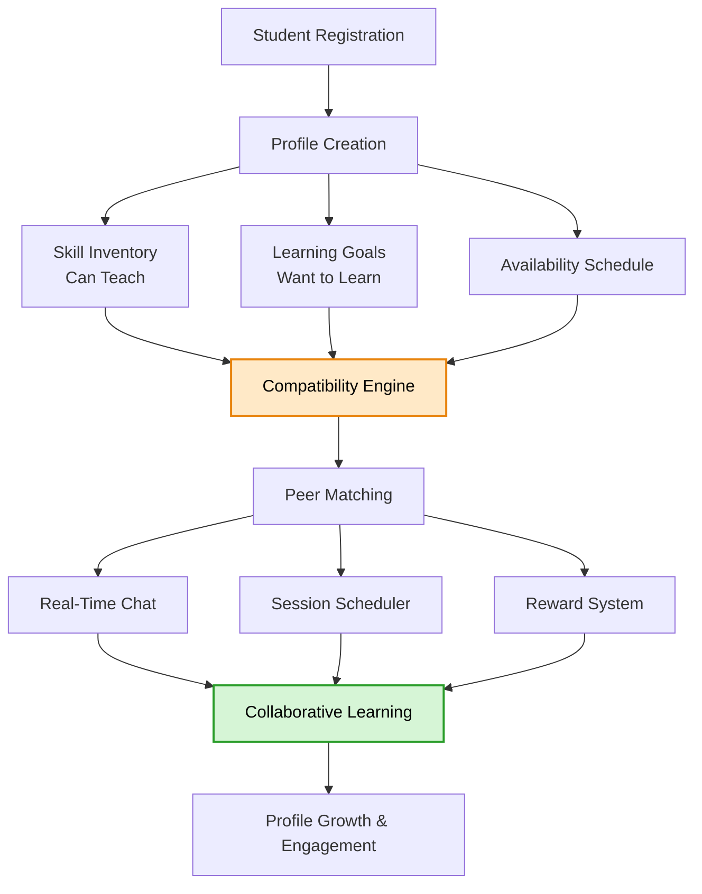

<div align="center">

# 🎓 SkillSwap
### Intelligent Peer-to-Peer Learning & Mentorship Platform

**An adaptive student collaboration platform that intelligently connects learners with peers who can teach, mentor, or study together—by combining profile intelligence, skill matching, timetable overlap, and real-time communication into a unified collaborative ecosystem.**


*Building meaningful learning connections—one skill at a time.*

</div>

---

# The Problem

Every student knows something valuable.

Some are exceptional programmers. Others excel in mathematics, design, music, public speaking, sports, or interview preparation.

At the same time, thousands of students are actively searching for someone willing to teach those exact skills.

Unfortunately, finding the right peer is surprisingly difficult.

Learning communities today rely on scattered WhatsApp groups, Discord servers, classroom announcements, and word of mouth. These methods lack personalization, scheduling support, and structured mentorship, causing valuable opportunities for collaborative learning to disappear.

What students need is a platform that can automatically answer:

- **Who can teach me?**
- **Who wants to learn what I know?**
- **When are both of us available?**
- **How do we continue learning together?**

SkillSwap is built to answer all four.

---

# Why SkillSwap Is Different

Most learning platforms simply list users or courses.

SkillSwap instead builds **intelligent learning relationships.**

🧠 **Dynamic Compatibility Matching.**

Rather than recommending users randomly, SkillSwap evaluates multiple profile dimensions—including teachable skills, learning goals, experience level, interests, and schedule overlap—to generate meaningful peer recommendations.

⚡ **Learning Doesn't Stop After Matching.**

Finding a partner is only the beginning.

Built-in messaging, editable schedules, and progress tracking encourage long-term engagement instead of one-time interactions.

📅 **Availability-Aware Connections.**

Two students may perfectly complement each other's skills—but if they are never free simultaneously, the recommendation is useless.

SkillSwap considers timetable intersections before suggesting matches.

🏆 **Gamified Collaboration.**

Sessions completed, mentorship provided, and skills learned contribute toward reward points and community recognition, encouraging continuous participation.

🌍 **Designed for Scale.**

The platform is built with a modular architecture capable of expanding from a single college to a nationwide collaborative learning network.

---

# Platform Architecture



---

# Learning Journey

Every stage increases collaboration quality.

| Stage | Outcome |
|--------|---------|
| Student Registration | Verified user account |
| Profile Completion | Skills & interests collected |
| Compatibility Matching | Best learning partners generated |
| Schedule Alignment | Common availability identified |
| Chat & Session Booking | Peer interaction begins |
| Learning Session | Knowledge exchange |
| Reward Tracking | Community engagement increases |

---

# How It Works

| # | Stage | In Plain Words |
|---|---------|----------------|
| 1 | **Authentication** | Students securely register and log into the platform using authenticated user accounts. |
| 2 | **Profile Creation** | Users define the skills they can teach, the skills they want to learn, academic interests, and availability schedule. |
| 3 | **Compatibility Analysis** | The matching engine evaluates complementary skills, mutual interests, learning priorities, and schedule overlap. |
| 4 | **Smart Match Generation** | High-quality mentor and learner pairs are recommended dynamically rather than using static lists. |
| 5 | **Real-Time Communication** | Matched users communicate instantly through Socket.io powered messaging. |
| 6 | **Session Scheduling** | Students organize learning sessions using editable availability calendars. |
| 7 | **Reward Tracking** | Every completed interaction contributes toward participation points and engagement history. |
| 8 | **Continuous Learning** | Students build long-term mentorship relationships while expanding their skill network. |

---

# Matching Engine

The recommendation system evaluates several compatibility signals.

```
Compatibility Score

=
Skill Match
+
Learning Goal Match
+
Availability Overlap
+
Shared Interests
+
Engagement Weight
```

| Component | Purpose |
|------------|---------|
| Skill Match | Measures whether one user's teachable skills satisfy another user's learning goals |
| Learning Goals | Prioritizes users actively seeking similar knowledge |
| Schedule Overlap | Ensures both users have common free time |
| Shared Interests | Improves collaboration quality |
| Engagement Score | Rewards active and reliable mentors |

Higher compatibility scores produce stronger recommendations.

---

# Platform Features

### 👤 User Profiles

- Personalized student profiles
- Skills offered
- Skills requested
- Academic interests
- Availability schedules

---

### 🤝 Intelligent Matching

- Dynamic compatibility scoring
- Mutual skill discovery
- Schedule-aware recommendations
- Peer mentoring suggestions

---

### 💬 Real-Time Communication

- Instant messaging
- Socket.io integration
- Live conversation updates

---

### 📅 Session Scheduling

- Editable availability
- Meeting planning
- Learning session organization

---

### 🏆 Rewards & Engagement

- Learning points
- Mentor participation tracking
- Community recognition

---

# Tech Stack

| Component | Technology | Why |
|------------|------------|-----|
| Frontend | React.js | Fast, component-based user interface |
| Routing | React Router | Seamless single-page navigation |
| Styling | Vanilla CSS | Lightweight and customizable UI |
| Backend | Node.js + Express.js | Scalable REST API architecture |
| Database | MySQL | Structured relational data management |
| Real-Time Layer | Socket.io | Instant peer communication |
| API Communication | Axios | Efficient client-server interaction |
| Authentication | Express Middleware + Environment Variables | Secure modular authentication |
| Deployment Ready | Modular MVC Structure | Easy scalability and maintenance |

---

# Project Structure

```text
SkillSwap/

├── client/
│   ├── public/
│   ├── src/
│   │   ├── pages/
│   │   ├── components/
│   │   ├── services/
│   │   ├── assets/
│   │   └── App.jsx
│
├── server/
│   ├── routes/
│   ├── controllers/
│   ├── middleware/
│   ├── models/
│   ├── config/
│   ├── socket/
│   └── server.js
│
├── database/
│   └── schema.sql
│
├── package.json
├── README.md
└── .env
```

---

# Getting Started

## Clone Repository

```bash
git clone https://github.com/yourusername/SkillSwap.git

cd SkillSwap
```

---

## Install Dependencies

### Frontend

```bash
cd client

npm install
```

### Backend

```bash
cd server

npm install
```

---

## Configure Environment

Create a `.env` file.

```env
PORT=5000

DB_HOST=localhost

DB_USER=root

DB_PASSWORD=your_password

DB_NAME=skillswap

JWT_SECRET=your_secret_key
```

---

## Run the Backend

```bash
npm start
```

---

## Run the Frontend

```bash
npm run dev
```

---

The application will be available at:

```
Frontend

http://localhost:5173

Backend

http://localhost:5000
```

---

# Future Roadmap

- [ ] AI-powered recommendation engine
- [ ] Learning behavior analytics
- [ ] Skill verification badges
- [ ] Video calling integration
- [ ] Multi-college collaborative network
- [ ] Mobile application
- [ ] Role-based administration dashboard
- [ ] Cloud deployment with Docker & Kubernetes

---

# Future AI Vision

SkillSwap's next evolution introduces an AI-assisted recommendation engine capable of learning from user behavior rather than relying solely on static profile information.

The system will analyze:

- Learning consistency
- Mentor responsiveness
- Session completion history
- Preferred learning styles
- Skill progression
- Community engagement

These insights will enable increasingly accurate peer recommendations over time, creating a personalized collaborative learning experience for every student.

---

# Acknowledgments

Built to encourage collaborative education through peer learning, mentorship, and intelligent matching.

Inspired by the belief that every student can be both a learner and a teacher.

---

# License

Released under the MIT License.

<div align="center">

**Learn Together. Teach Together. Grow Together.**

**SkillSwap**

</div>
