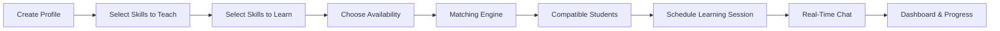

<div align="center">

# 🎓 SkillSwap
### Peer-to-Peer Learning Platform

**An intelligent full-stack platform that connects students through skill exchange by combining profile-based matching, schedule optimization, and real-time collaboration into a seamless learning ecosystem.**


</div>

---

# The Problem

Students often possess valuable academic knowledge, technical expertise, creative abilities, or extracurricular skills that could benefit others. However, discovering peers with complementary learning goals is difficult, fragmented, and largely dependent on personal networks or messaging groups.

Traditional communication platforms lack intelligent matching, structured scheduling, and collaborative tools, making peer learning inefficient and limiting opportunities for knowledge exchange.

SkillSwap addresses this by creating a centralized platform where every student can simultaneously become both a learner and a mentor.

---

# The Solution

SkillSwap transforms peer learning into a structured, data-driven experience through two interconnected systems:

### 🤝 Intelligent Matching Engine

Student profiles, teachable skills, learning interests, and availability are combined to generate compatibility-based peer recommendations instead of simple keyword matches.

### 📅 Collaborative Learning Platform

Once matched, students can communicate, manage schedules, update profiles, and organize learning sessions within a single platform, creating a continuous and engaging learning ecosystem.

---

# Why SkillSwap is Different

🎯 **Mutual Skill Exchange**

Unlike traditional tutoring platforms where learning flows in one direction, SkillSwap enables every user to both teach and learn, encouraging collaborative knowledge sharing.

⚡ **Dynamic Profile-Based Matching**

Recommendations are generated by combining teachable skills, learning goals, availability overlap, and user preferences instead of relying solely on subject selection.

📚 **Beyond Academics**

SkillSwap supports hundreds of skills across academics, programming, languages, sports, music, art, public speaking, finance, photography, cooking, and many more, making it suitable for holistic peer development.

💬 **Collaborative Experience**

Integrated scheduling, profile management, and real-time communication keep the entire learning journey inside one platform without requiring external tools.

---

# Platform Workflow



---

# Core Features

| Feature | Description |
|---------|-------------|
| 👤 Profile Management | Create and edit personalized student profiles |
| 🎯 Skill Matching | Match students using teachable skills, learning goals, and availability |
| 📚 Skill Marketplace | Browse hundreds of categorized academic and extracurricular skills |
| 📅 Timetable Generation | Automatically generate compatible learning schedules |
| 💬 Real-Time Chat | Instant messaging between matched students |
| 🏆 Reward System | Encourage knowledge sharing through participation points |
| 📊 Dashboard | Track matches, sessions, and learning activity |
| 🔄 Dynamic Updates | Profile edits automatically influence future matches |

---

# Tech Stack

| Component | Technology | Purpose |
|-----------|------------|---------|
| Frontend | React.js | Responsive single-page user interface |
| Backend | Flask | Business logic and API handling |
| Database | MySQL | Persistent storage for users, skills, matches, and schedules |
| Communication | REST APIs | Connect frontend and backend |
| Version Control | Git & GitHub | Source code management |
| Development | VS Code | Development environment |

---

# Project Structure

```text
skillswap/
│
├── frontend/
│   ├── src/
│   │   ├── pages/
│   │   ├── components/
│   │   ├── assets/
│   │   └── App.js
│   └── public/
│
├── backend/
│   ├── app.py
│   ├── routes/
│   ├── models/
│   ├── database/
│   └── config/
│
├── screenshots/
├── README.md
├── requirements.txt
└── .gitignore
```

---

# Getting Started

```bash
git clone https://github.com/your-username/skillswap.git

cd backend
pip install -r requirements.txt
python app.py

cd ../frontend
npm install
npm start
```

The application will launch locally at:

```
Frontend: http://localhost:3000
Backend: http://localhost:5000
```

---

# Future Roadmap

- AI-powered recommendation engine
- Personalized learning analytics
- Video calling integration
- Mobile application
- Multi-college networking
- Skill certification
- Community learning groups
- Calendar synchronization

---

# License

Released under the MIT License.

<div align="center">

**Connecting Students Through Skills.**

*Team SkillSwap · PICT Pune · CEP*

</div>
