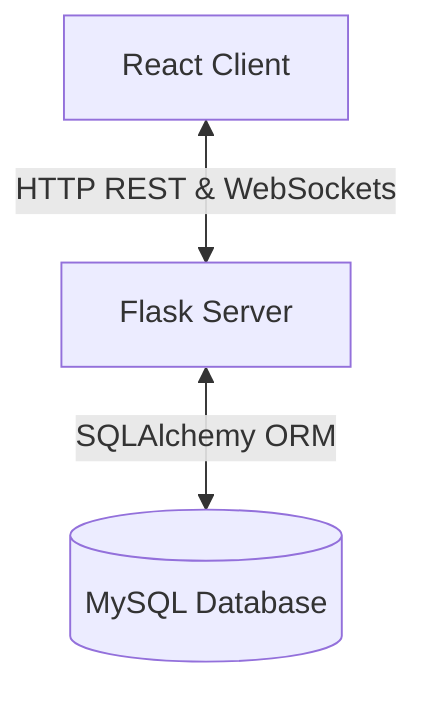

# SkillSwap Architecture Documentation

This document describes the architectural layout, directory structure, data flow, and technologies used in the SkillSwap platform.

---

## 🏛️ System Architecture

The application is structured as a clean full-stack web application with a decoupled Frontend and Backend.



### Frontend (React)
- **Framework**: React 18
- **Styling**: Native CSS stylesheets, organized in `src/styles/`
- **Routing**: React Router DOM (v6)
- **API Services**: Centralized Axios handler in `src/services/api.js` for clean state management.
- **Context**: Centralized state management in `src/context/AppContext.js`.

### Backend (Flask)
- **Language**: Python 3.x
- **Framework**: Flask
- **ORM**: Flask-SQLAlchemy (MySQL connection via `pymysql`)
- **Authentication**: Flask-Login + Flask-Bcrypt
- **Real-Time Communication**: Flask-SocketIO (with `eventlet` web server)
- **Architecture Pattern**: Controllers + Services + Models

---

## 📂 Project Structure

```
skillswap/
├── frontend/                     # React Application
│   ├── public/
│   └── src/
│       ├── assets/               # Logos, images, graphics
│       ├── components/           # Common components (e.g. Navbar)
│       ├── context/              # AppContext state manager
│       ├── pages/                # Page views (Dashboard, Matches, Profile, Timetable)
│       ├── services/             # Centralized Axios API requests (api.js)
│       ├── styles/               # CSS stylesheets
│       └── App.js                # App Router and bootstrap
│
├── backend/                      # Backend Application
│   ├── app/
│   │   ├── controllers/          # Request/response handlers
│   │   ├── database/             # SQLAlchemy db initializer
│   │   ├── middleware/           # Placeholders for future middleware
│   │   ├── models/               # SQLAlchemy MySQL models
│   │   ├── routes/               # API route definitions & blueprints
│   │   ├── services/             # Core business logic (matching, scheduling, rewards)
│   │   ├── sockets/              # Socket.IO chat connection events
│   │   ├── utils/                # Helper functions
│   │   └── __init__.py           # App Factory creator
│   │
│   ├── config/                   # Centralized configuration (settings.py)
│   ├── tests/                    # Unit testing files
│   ├── requirements.txt          # Python dependencies
│   ├── run.py                    # Entry point script
│   └── .env.example              # Sample environment configuration
│
├── docs/                         # Developer documentation
│   ├── architecture.md
│   └── api.md
│
├── .gitignore                    # Git ignores for Node.js, Pycache and environments
└── README.md                     # Project README
```

---

## 🔄 Core Data Flows

### 1. Matchmaking Algorithm
1. User saves profile details (skills taught, skills learned, availability slots).
2. The user controller receives the payload, saves it, and invokes `matching.py` service.
3. The service scores user overlaps:
   - Base overlap points: `+20`.
   - Skill teach/learn overlap matching level & urgency rules: `+10` to `+15` points.
   - Calendars day/time overlap slots: `+10` points.
4. Generates a score capped at `98%` and writes match rows to the database.

### 2. Live Chat (WebSockets)
1. When opening the Chat sidebar on the Dashboard, the React client emits a `join_room` socket event with the match ID.
2. The socket controller binds the client connection to a room (`match-<match_id>`).
3. Typing a message emits `send_message` with JSON payload `{ senderId, receiverId, matchId, content }`.
4. The server receives the event, commits the message row to the database, and broadcasts a `receive_message` payload back to the room.
